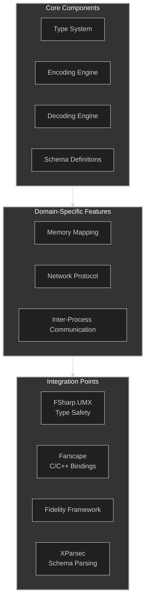
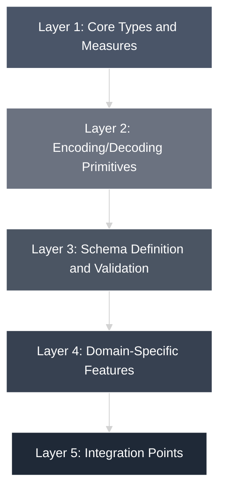
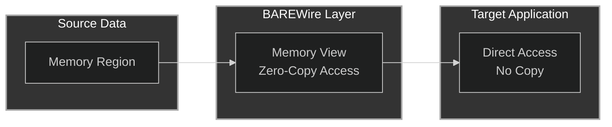

# BAREWire Architecture Overview

BAREWire is designed as a modular system with several core components that work together to provide a comprehensive solution for binary data encoding, memory mapping, and communication.

## Project Structure 

BAREWire/
├── Core/
│   ├── Types.fs           # Core type definitions and measures
│   ├── Memory.fs          # Memory representation and operations
│   └── Error.fs           # Error handling types
├── Encoding/
│   ├── Encoder.fs         # Encoding primitives
│   ├── Decoder.fs         # Decoding primitives
│   └── Codec.fs           # Combined encoding/decoding operations
├── Schema/
│   ├── Definition.fs      # Schema type definitions
│   ├── Validation.fs      # Schema validation logic
│   ├── Analysis.fs        # Schema analysis tools
│   └── DSL.fs             # Domain-specific language for schema definition
├── Memory/
│   ├── Region.fs          # Memory region operations
│   ├── View.fs            # Memory view operations
│   └── Mapping.fs         # Memory mapping functions
├── Network/
│   ├── Frame.fs           # Frame format for binary communication
│   ├── Transport.fs       # Transport abstractions
│   └── Protocol.fs        # Message passing primitives
└── IPC/
    ├── SharedMemory.fs    # Shared memory regions
    ├── MessageQueue.fs    # Message queues
    └── NamedPipe.fs       # Named pipes

## Core Components

## Design Principles

1. **Zero Dependencies**: BAREWire is implemented in pure F# with no external dependencies, making it suitable for use in constrained environments.

2. **Type Safety**: The library leverages F#'s type system, particularly through integration with FSharp.UMX, to provide compile-time type safety for serialized data.

3. **Performance First**: All operations are optimized for high performance with minimal allocations and efficient memory usage.

4. **Composability**: Components are designed to be composable, allowing developers to use only the parts they need.

5. **Cross-Platform Compatibility**: The library is designed to work across .NET, Fable, and the Fidelity Framework.

## Layered Architecture

BAREWire follows a layered architecture:

### Layer 1: Core Types and Measures

The foundation of BAREWire consists of core types and units of measure that define the binary format and ensure type safety.

### Layer 2: Encoding/Decoding Primitives

This layer provides the fundamental operations for encoding and decoding primitive BARE types.

### Layer 3: Schema Definition and Validation

Schemas define the structure of BARE messages and provide validation during encoding and decoding.

### Layer 4: Domain-Specific Features

This layer implements domain-specific features like memory mapping, network protocols, and IPC.

### Layer 5: Integration Points

The topmost layer provides integration points with other systems like Farscape, the Fidelity Framework, and application code.

## Memory Management

BAREWire uses a zero-copy approach whenever possible to minimize allocations and copies:

This architecture enables efficient processing of large binary data structures without unnecessary memory copying.