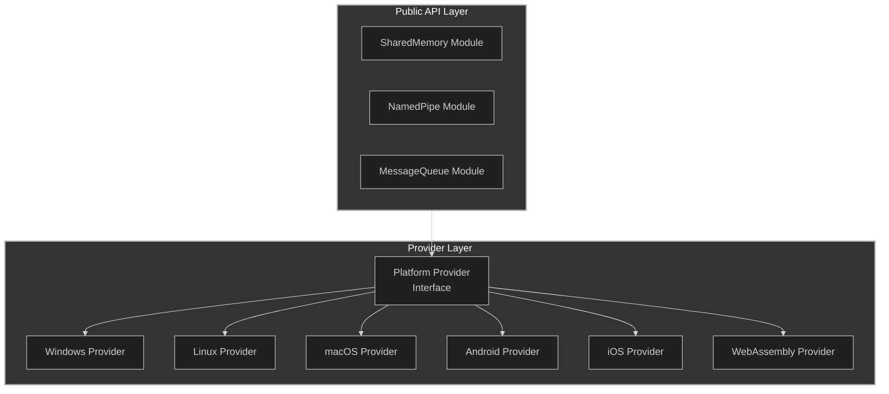
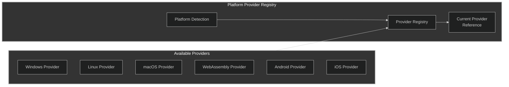
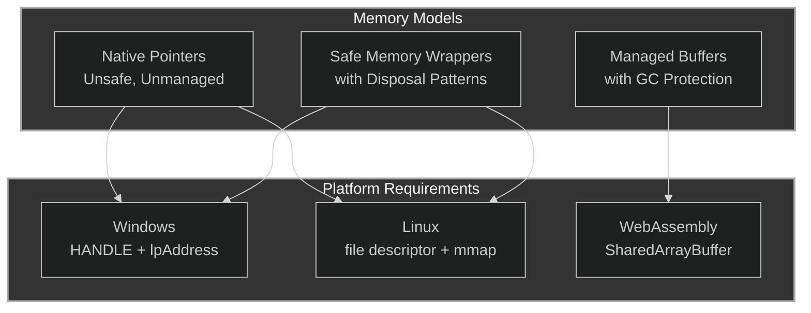
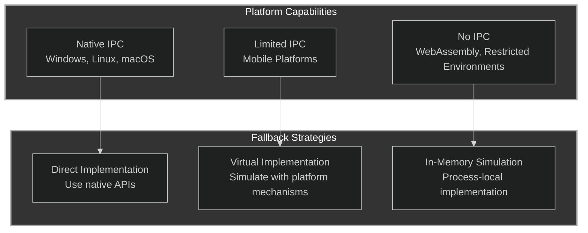
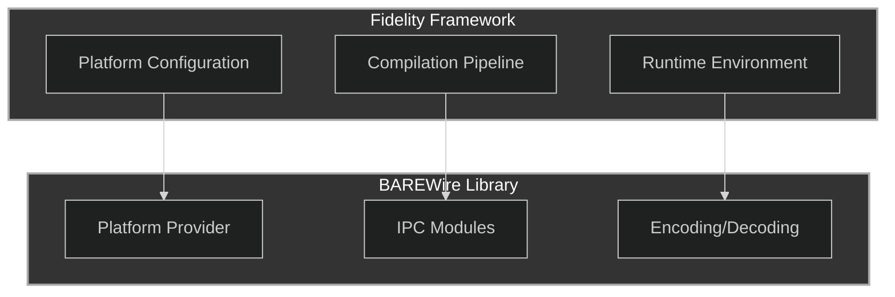

# Architectural Memo: Platform-Specific APIs in BAREWire

## 1. Introduction: The Cross-Platform Challenge

The BAREWire library aims to provide efficient, type-safe binary data encoding, memory mapping, and inter-process communication across diverse computing environments. The existing codebase contains numerous placeholders for "platform-specific APIs" that would need concrete implementations to make the library functional across different operating systems and hardware architectures.

This memo outlines an architectural approach for implementing these platform-specific aspects while maintaining a consistent, type-safe API and preserving the functional programming paradigm that underpins the library.

## 2. Core Architectural Pattern

### 2.1 The Provider Pattern

I recommend adopting a provider pattern for platform-specific implementations:



### 2.2 Provider Interface

Each platform-specific API category would be defined by an interface:

```fsharp
/// Interface for platform-specific IPC operations
type IPlatformIpc =
    /// Creates a named pipe
    abstract CreateNamedPipe: name:string * direction:PipeDirection * mode:PipeMode -> Result<nativeint>
    
    /// Connects to a named pipe
    abstract ConnectNamedPipe: handle:nativeint -> Result<unit>
    
    /// Creates a shared memory region
    abstract CreateSharedMemory: name:string * size:int<bytes> -> Result<nativeint * nativeptr<byte>>
    
    /// Opens an existing shared memory region
    abstract OpenSharedMemory: name:string -> Result<nativeint * nativeptr<byte> * int<bytes>>
    
    // Additional platform-specific operations...
```

## 3. Platform Provider Registry

To select the appropriate provider at runtime, we would use a provider registry:



### 3.1 Implementation Strategy

```fsharp
/// Platform provider registry module
module PlatformProvider =
    /// Platform type enum
    type PlatformType =
        | Windows
        | Linux
        | MacOS
        | Android
        | iOS
        | WebAssembly
        | Unknown
    
    /// Gets the current platform type
    let getCurrentPlatform () =
        #if WINDOWS
            PlatformType.Windows
        #elif LINUX
            PlatformType.Linux
        #elif MACOS
            PlatformType.MacOS
        #elif ANDROID
            PlatformType.Android
        #elif IOS
            PlatformType.iOS
        #elif WASM
            PlatformType.WebAssembly
        #else
            PlatformType.Unknown
        #endif
    
    /// Registry of platform providers
    let private providers = new System.Collections.Generic.Dictionary<PlatformType, IPlatformIpc>()
    
    /// Registers a platform provider
    let registerProvider (platform: PlatformType) (provider: IPlatformIpc) =
        providers.[platform] <- provider
    
    /// Gets the current platform provider
    let getCurrentProvider () =
        let platform = getCurrentPlatform()
        if providers.ContainsKey(platform) then
            Ok providers.[platform]
        else
            Error (invalidValueError $"No provider registered for platform: {platform}")
```

## 4. Platform-Specific Implementations

### 4.1 Windows Implementation

```fsharp
/// Windows platform implementation
module WindowsProvider =
    type WindowsIpcProvider() =
        interface IPlatformIpc with
            member this.CreateNamedPipe(name, direction, mode) =
                // Use Windows API: CreateNamedPipe
                try
                    let directionFlag =
                        match direction with
                        | PipeDirection.In -> 0x1u  // PIPE_ACCESS_INBOUND
                        | PipeDirection.Out -> 0x2u // PIPE_ACCESS_OUTBOUND
                        | PipeDirection.InOut -> 0x3u // PIPE_ACCESS_DUPLEX
                    
                    let modeFlag =
                        match mode with
                        | PipeMode.Byte -> 0x0u     // PIPE_TYPE_BYTE
                        | PipeMode.Message -> 0x4u  // PIPE_TYPE_MESSAGE
                    
                    let handle =
                        NativeMethods.CreateNamedPipe(
                            $"\\\\.\\pipe\\{name}",
                            directionFlag,
                            modeFlag ||| 0x0u,  // PIPE_WAIT
                            255u,               // PIPE_UNLIMITED_INSTANCES
                            4096u,              // Output buffer size
                            4096u,              // Input buffer size
                            0u,                 // Default timeout
                            IntPtr.Zero         // Default security attributes
                        )
                    
                    if handle = -1n then
                        let error = Marshal.GetLastWin32Error()
                        Error (invalidValueError $"Failed to create named pipe: Win32 error {error}")
                    else
                        Ok handle
                with ex ->
                    Error (invalidValueError $"Failed to create named pipe: {ex.Message}")
            
            member this.ConnectNamedPipe(handle) =
                // Use Windows API: ConnectNamedPipe
                try
                    let success = NativeMethods.ConnectNamedPipe(handle, IntPtr.Zero)
                    if success = 0 then
                        let error = Marshal.GetLastWin32Error()
                        if error = 535 then // ERROR_PIPE_CONNECTED
                            Ok ()  // Client already connected, this is not an error
                        else
                            Error (invalidValueError $"Failed to connect named pipe: Win32 error {error}")
                    else
                        Ok ()
                with ex ->
                    Error (invalidValueError $"Failed to connect named pipe: {ex.Message}")
            
            member this.CreateSharedMemory(name, size) =
                // Use Windows API: CreateFileMapping, MapViewOfFile
                try
                    let fileHandle =
                        NativeMethods.CreateFileMapping(
                            -1n,                // INVALID_HANDLE_VALUE
                            IntPtr.Zero,        // Default security attributes
                            0x4u,               // PAGE_READWRITE
                            0u,                 // High-order 32 bits of size
                            uint32 (int size),  // Low-order 32 bits of size
                            name                // Name of the mapping object
                        )
                    
                    if fileHandle = 0n then
                        let error = Marshal.GetLastWin32Error()
                        Error (invalidValueError $"Failed to create file mapping: Win32 error {error}")
                    else
                        let viewPtr =
                            NativeMethods.MapViewOfFile(
                                fileHandle,
                                0xF001Fu,       // FILE_MAP_ALL_ACCESS
                                0u,             // High-order 32 bits of offset
                                0u,             // Low-order 32 bits of offset
                                UIntPtr(uint64 (int size)) // Number of bytes to map
                            )
                        
                        if viewPtr = IntPtr.Zero then
                            let error = Marshal.GetLastWin32Error()
                            NativeMethods.CloseHandle(fileHandle) |> ignore
                            Error (invalidValueError $"Failed to map view of file: Win32 error {error}")
                        else
                            let bytePtr = NativeInterop.NativePtr.ofVoidPtr (viewPtr.ToPointer())
                            Ok (fileHandle, bytePtr)
                with ex ->
                    Error (invalidValueError $"Failed to create shared memory: {ex.Message}")
            
            // Additional implementation methods...

    // P/Invoke declarations for Windows API
    module private NativeMethods =
        [<DllImport("kernel32.dll", SetLastError = true)>]
        extern IntPtr CreateNamedPipe(string lpName, uint32 dwOpenMode, uint32 dwPipeMode,
                                      uint32 nMaxInstances, uint32 nOutBufferSize,
                                      uint32 nInBufferSize, uint32 nDefaultTimeOut,
                                      IntPtr lpSecurityAttributes)
        
        [<DllImport("kernel32.dll", SetLastError = true)>]
        extern int ConnectNamedPipe(IntPtr hNamedPipe, IntPtr lpOverlapped)
        
        [<DllImport("kernel32.dll", SetLastError = true)>]
        extern IntPtr CreateFileMapping(IntPtr hFile, IntPtr lpAttributes,
                                        uint32 flProtect, uint32 dwMaximumSizeHigh,
                                        uint32 dwMaximumSizeLow, string lpName)
        
        [<DllImport("kernel32.dll", SetLastError = true)>]
        extern IntPtr MapViewOfFile(IntPtr hFileMappingObject, uint32 dwDesiredAccess,
                                    uint32 dwFileOffsetHigh, uint32 dwFileOffsetLow,
                                    UIntPtr dwNumberOfBytesToMap)
        
        [<DllImport("kernel32.dll", SetLastError = true)>]
        extern bool CloseHandle(IntPtr hObject)
        
        // Additional P/Invoke declarations...
```

### 4.2 Linux Implementation

```fsharp
/// Linux platform implementation
module LinuxProvider =
    type LinuxIpcProvider() =
        interface IPlatformIpc with
            member this.CreateNamedPipe(name, direction, mode) =
                // Use Linux APIs: mkfifo, open
                try
                    let directionFlag =
                        match direction with
                        | PipeDirection.In -> 0     // O_RDONLY
                        | PipeDirection.Out -> 1    // O_WRONLY
                        | PipeDirection.InOut -> 2  // O_RDWR
                    
                    // Create the FIFO
                    let result = NativeMethods.mkfifo($"/tmp/{name}", 0o666)
                    if result = -1 then
                        let errno = Marshal.GetLastWin32Error()
                        // EEXIST is not an error if the FIFO already exists
                        if errno <> 17 then // EEXIST
                            Error (invalidValueError $"Failed to create FIFO: errno {errno}")
                        else
                            // FIFO already exists, continue
                            ()
                    
                    // Open the FIFO
                    let fd = NativeMethods.open($"/tmp/{name}", directionFlag, 0)
                    if fd = -1 then
                        let errno = Marshal.GetLastWin32Error()
                        Error (invalidValueError $"Failed to open FIFO: errno {errno}")
                    else
                        // Set non-blocking if message mode
                        if mode = PipeMode.Message then
                            let flags = NativeMethods.fcntl(fd, 3, 0) // F_GETFL
                            if flags = -1 then
                                NativeMethods.close(fd) |> ignore
                                let errno = Marshal.GetLastWin32Error()
                                Error (invalidValueError $"Failed to get file flags: errno {errno}")
                            else
                                let result = NativeMethods.fcntl(fd, 4, flags ||| 2048) // F_SETFL, O_NONBLOCK
                                if result = -1 then
                                    NativeMethods.close(fd) |> ignore
                                    let errno = Marshal.GetLastWin32Error()
                                    Error (invalidValueError $"Failed to set file flags: errno {errno}")
                                else
                                    Ok (nativeint fd)
                        else
                            Ok (nativeint fd)
                with ex ->
                    Error (invalidValueError $"Failed to create named pipe: {ex.Message}")
            
            member this.CreateSharedMemory(name, size) =
                // Use Linux APIs: shm_open, mmap
                try
                    let fd = NativeMethods.shm_open($"/{name}", 0o2 ||| 0o100, 0o666) // O_RDWR | O_CREAT
                    if fd = -1 then
                        let errno = Marshal.GetLastWin32Error()
                        Error (invalidValueError $"Failed to open shared memory object: errno {errno}")
                    else
                        // Set the size of the shared memory object
                        let result = NativeMethods.ftruncate(fd, int64 (int size))
                        if result = -1 then
                            NativeMethods.close(fd) |> ignore
                            let errno = Marshal.GetLastWin32Error()
                            Error (invalidValueError $"Failed to set shared memory size: errno {errno}")
                        else
                            // Map the shared memory object
                            let addr = NativeMethods.mmap(
                                IntPtr.Zero,
                                UIntPtr(uint64 (int size)),
                                0x1 ||| 0x2,  // PROT_READ | PROT_WRITE
                                0x1,          // MAP_SHARED
                                fd,
                                0L
                            )
                            
                            if addr = -1n then
                                NativeMethods.close(fd) |> ignore
                                let errno = Marshal.GetLastWin32Error()
                                Error (invalidValueError $"Failed to map shared memory: errno {errno}")
                            else
                                let bytePtr = NativeInterop.NativePtr.ofVoidPtr (addr.ToPointer())
                                Ok (nativeint fd, bytePtr)
                with ex ->
                    Error (invalidValueError $"Failed to create shared memory: {ex.Message}")
            
            // Additional implementation methods...

    // P/Invoke declarations for Linux API
    module private NativeMethods =
        [<DllImport("libc", SetLastError = true)>]
        extern int mkfifo(string pathname, int mode)
        
        [<DllImport("libc", SetLastError = true)>]
        extern int open(string pathname, int flags, int mode)
        
        [<DllImport("libc", SetLastError = true)>]
        extern int close(int fd)
        
        [<DllImport("libc", SetLastError = true)>]
        extern int fcntl(int fd, int cmd, int arg)
        
        [<DllImport("libc", SetLastError = true)>]
        extern int shm_open(string name, int oflag, int mode)
        
        [<DllImport("libc", SetLastError = true)>]
        extern int ftruncate(int fd, int64 length)
        
        [<DllImport("libc", SetLastError = true)>]
        extern IntPtr mmap(IntPtr addr, UIntPtr length, int prot, int flags, int fd, int64 offset)
        
        // Additional P/Invoke declarations...
```

## 5. Integrating with the Core BAREWire API

### 5.1 Revising the Named Pipe Implementation

```fsharp
/// Named pipes for inter-process communication
module NamedPipe =
    // ... existing type definitions ...
    
    /// Creates a new named pipe server
    let createServer<'T> 
                    (name: string) 
                    (schema: SchemaDefinition<validated>)
                    (options: PipeOptions): Result<Pipe<'T>> =
        // Get the current platform provider
        PlatformProvider.getCurrentProvider()
        |> Result.bind (fun provider ->
            // Create the native pipe
            provider.CreateNamedPipe(
                name,
                options.Direction,
                options.Mode
            )
            |> Result.map (fun handle ->
                {
                    Name = name
                    Schema = schema
                    Handle = handle
                    IsServer = true
                    Options = options
                }
            )
        )
```

### 5.2 Revising the Shared Memory Implementation

```fsharp
/// Shared memory regions for inter-process communication
module SharedMemory =
    // ... existing type definitions ...
    
    /// Creates a new shared memory region
    let create<'T> 
              (name: string) 
              (size: int<bytes>) 
              (schema: SchemaDefinition<validated>): Result<SharedRegion<'T, region>> =
        // Get the current platform provider
        PlatformProvider.getCurrentProvider()
        |> Result.bind (fun provider ->
            // Create the native shared memory
            provider.CreateSharedMemory(name, size)
            |> Result.bind (fun (handle, ptr) ->
                // Create the region using the native memory
                let region = Region.createFromNativeMemory<'T, region> ptr size
                
                Ok {
                    Region = region
                    Name = name
                    Handle = handle
                }
            )
        )
```

## 6. Cross-Platform Memory Models

### 6.1 Memory Safety Challenges

Different platforms have different memory safety guarantees and requirements:



### 6.2 Resource Management Approach

To address these challenges, we would implement a resource management pattern:

```fsharp
/// Disposable resource wrapper
type Resource<'T> =
    {
        /// The resource value
        Value: 'T
        
        /// Disposal action
        Dispose: unit -> unit
    }
    interface IDisposable with
        member this.Dispose() = this.Dispose()

/// Creates a resource that will be properly disposed
let using<'T, 'U> (resource: Resource<'T>) (f: 'T -> 'U): 'U =
    try
        f resource.Value
    finally
        resource.Dispose()

/// Resource management module for platform-specific resources
module ResourceManager =
    /// Creates a shared memory resource
    let createSharedMemory<'T> 
                          (name: string) 
                          (size: int<bytes>) 
                          (schema: SchemaDefinition<validated>): Result<Resource<SharedRegion<'T, region>>> =
        PlatformProvider.getCurrentProvider()
        |> Result.bind (fun provider ->
            provider.CreateSharedMemory(name, size)
            |> Result.bind (fun (handle, ptr) ->
                let region = Region.createFromNativeMemory<'T, region> ptr size
                
                let sharedRegion = {
                    Region = region
                    Name = name
                    Handle = handle
                }
                
                let dispose () =
                    provider.CloseSharedMemory(handle, ptr, size) |> ignore
                
                Ok {
                    Value = sharedRegion
                    Dispose = dispose
                }
            )
        )
```

## 7. Web and Mobile Integration 

### 7.1 WebAssembly Provider

For WebAssembly environments, which have no native OS-level IPC capabilities:

```fsharp
/// WebAssembly platform implementation
module WebAssemblyProvider =
    type WebAssemblyIpcProvider() =
        interface IPlatformIpc with
            member this.CreateNamedPipe(name, direction, mode) =
                // Web has no native pipes, use a virtual implementation via SharedArrayBuffer
                try
                    // Create a shared array buffer for the pipe
                    let buffer = JS.Constructors.SharedArrayBuffer.Create(4096)
                    
                    // Store the buffer in the global registry with the pipe name
                    JS.GlobalThis.Set($"__barewire_pipe_{name}", buffer)
                    
                    // Return a handle that is just the JS reference ID for the buffer
                    let id = System.Runtime.CompilerServices.RuntimeHelpers.GetHashCode(buffer)
                    Ok (nativeint id)
                with ex ->
                    Error (invalidValueError $"Failed to create virtual named pipe: {ex.Message}")
            
            member this.CreateSharedMemory(name, size) =
                // Use SharedArrayBuffer for shared memory
                try
                    // Create a shared array buffer
                    let buffer = JS.Constructors.SharedArrayBuffer.Create(int size)
                    
                    // Create a view over the buffer
                    let view = JS.Constructors.Uint8Array.Create(buffer)
                    
                    // Store the buffer and view in the global registry
                    JS.GlobalThis.Set($"__barewire_shm_{name}", buffer)
                    
                    // Since we can't get a native pointer, we use an accessor interface
                    let memoryAccessor = WebMemoryAccessor(view)
                    
                    // Return a handle that is just the JS reference ID
                    let id = System.Runtime.CompilerServices.RuntimeHelpers.GetHashCode(buffer)
                    Ok (nativeint id, memoryAccessor.AsPointer())
                with ex ->
                    Error (invalidValueError $"Failed to create shared memory: {ex.Message}")
            
            // Additional implementation methods...
    
    /// Memory accessor for WebAssembly
    type WebMemoryAccessor(view: JS.TypedArray<byte>) =
        // A virtual pointer implementation for WebAssembly
        let mutable base' = 0<offset>
        
        /// Gets a byte from the buffer
        member this.GetByte(offset: int<offset>): byte =
            view[int offset]
        
        /// Sets a byte in the buffer
        member this.SetByte(offset: int<offset>, value: byte): unit =
            view[int offset] <- value
        
        /// Gets a span of the buffer
        member this.GetSpan(offset: int<offset>, length: int<bytes>): ReadOnlySpan<byte> =
            // Create a .NET array from the TypedArray subset
            let arr = Array.zeroCreate (int length)
            for i = 0 to (int length) - 1 do
                arr[i] <- view[int offset + i]
            ReadOnlySpan<byte>(arr)
        
        /// Sets data from a span into the buffer
        member this.SetSpan(offset: int<offset>, data: ReadOnlySpan<byte>): unit =
            for i = 0 to data.Length - 1 do
                view[int offset + i] <- data[i]
        
        /// Returns a virtual "pointer" to the memory (really just a token)
        member this.AsPointer(): nativeptr<byte> =
            // We can't actually get a pointer in WebAssembly, so we use a dummy value
            // and track the base offset separately
            NativeInterop.NativePtr.ofVoidPtr (1n.ToPointer())
```

### 7.2 Mobile Platform Integration

For mobile platforms with restricted IPC capabilities:

```fsharp
/// Android platform implementation
module AndroidProvider =
    type AndroidIpcProvider() =
        interface IPlatformIpc with
            member this.CreateNamedPipe(name, direction, mode) =
                // Android doesn't support traditional named pipes
                // Use a virtual implementation via content providers or local sockets
                try
                    match direction with
                    | PipeDirection.In | PipeDirection.Out ->
                        // For unidirectional pipes, use Android's LocalSocket
                        let socket = new LocalSocket()
                        let address = new LocalSocketAddress(name, LocalSocketAddress.Namespace.FILESYSTEM)
                        
                        if direction = PipeDirection.In then
                            // Server (read) socket
                            let server = new LocalServerSocket(address)
                            // Store the server socket in a global registry
                            AndroidSocketRegistry.RegisterServer(name, server)
                            // Return a handle that represents the server socket
                            let id = System.Runtime.CompilerServices.RuntimeHelpers.GetHashCode(server)
                            Ok (nativeint id)
                        else
                            // Client (write) socket
                            socket.Connect(address)
                            // Store the socket in a global registry
                            AndroidSocketRegistry.RegisterClient(name, socket)
                            // Return a handle that represents the client socket
                            let id = System.Runtime.CompilerServices.RuntimeHelpers.GetHashCode(socket)
                            Ok (nativeint id)
                    
                    | PipeDirection.InOut ->
                        // For bidirectional pipes, use Android's LocalServerSocket and LocalSocket
                        // in a more complex setup (omitted for brevity)
                        // Return a handle that represents both sockets
                        let id = hash name
                        Ok (nativeint id)
                with ex ->
                    Error (invalidValueError $"Failed to create virtual named pipe: {ex.Message}")
            
            member this.CreateSharedMemory(name, size) =
                // On newer Android versions, use SharedMemory API
                // On older versions, use MemoryFile as a fallback
                try
                    if Build.VERSION.SDK_INT >= BuildVersionCodes.O_MR1 then
                        // Use Android's SharedMemory API
                        let sharedMemory = SharedMemory.Create(name, int size)
                        let fileDescriptor = sharedMemory.FileDescriptor
                        
                        // Memory map the shared memory
                        let byteBuffer = 
                            MemoryMappedFile.FromFileDescriptor(
                                fileDescriptor, 
                                0L, 
                                int64 (int size),
                                MemoryMappedFile.ProtectionFlags.ReadWrite)
                        
                        // Store in registry
                        AndroidMemoryRegistry.Register(name, sharedMemory, byteBuffer)
                        
                        // Create a virtual pointer (we can't get an actual pointer in Java/Android)
                        let id = System.Runtime.CompilerServices.RuntimeHelpers.GetHashCode(byteBuffer)
                        let accessor = AndroidMemoryAccessor(byteBuffer)
                        
                        Ok (nativeint id, accessor.AsPointer())
                    else
                        // Use MemoryFile for older Android versions
                        let memoryFile = new MemoryFile(name, int size)
                        let byteBuffer = memoryFile.MemoryMappedByteBuffer
                        
                        // Store in registry
                        AndroidMemoryRegistry.RegisterLegacy(name, memoryFile, byteBuffer)
                        
                        // Create a virtual pointer
                        let id = System.Runtime.CompilerServices.RuntimeHelpers.GetHashCode(byteBuffer)
                        let accessor = AndroidMemoryAccessor(byteBuffer)
                        
                        Ok (nativeint id, accessor.AsPointer())
                with ex ->
                    Error (invalidValueError $"Failed to create shared memory: {ex.Message}")
            
            // Additional implementation methods...
```

## 8. Fallback and Simulation Strategies

For platforms with limited or no IPC capabilities, we can implement simulations:



### 8.1 In-Memory Simulation Provider

```fsharp
/// In-memory simulation provider for platforms without IPC capabilities
module InMemoryProvider =
    type InMemoryIpcProvider() =
        // Global registries for simulated resources
        let pipes = new System.Collections.Concurrent.ConcurrentDictionary<string, obj>()
        let memories = new System.Collections.Concurrent.ConcurrentDictionary<string, byte[]>()
        
        interface IPlatformIpc with
            member this.CreateNamedPipe(name, direction, mode) =
                try
                    // For in-memory simulation, a pipe is just a ConcurrentQueue
                    let queue = new System.Collections.Concurrent.ConcurrentQueue<byte[]>()
                    
                    if pipes.TryAdd(name, queue) then
                        // Return a handle that is just an identifier
                        let id = System.Runtime.CompilerServices.RuntimeHelpers.GetHashCode(queue)
                        Ok (nativeint id)
                    else
                        Error (invalidValueError $"Pipe with name '{name}' already exists")
                with ex ->
                    Error (invalidValueError $"Failed to create in-memory pipe: {ex.Message}")
            
            member this.CreateSharedMemory(name, size) =
                try
                    // For in-memory simulation, shared memory is just a byte array
                    let memory = Array.zeroCreate (int size)
                    
                    if memories.TryAdd(name, memory) then
                        // Pin the array to get a fixed address
                        let handle = GCHandle.Alloc(memory, GCHandleType.Pinned)
                        let ptr = handle.AddrOfPinnedObject()
                        let bytePtr = NativeInterop.NativePtr.ofVoidPtr (ptr.ToPointer())
                        
                        // Return a handle that carries the GCHandle to prevent collection
                        let id = GCHandle.ToIntPtr(handle)
                        Ok (id, bytePtr)
                    else
                        Error (invalidValueError $"Shared memory with name '{name}' already exists")
                with ex ->
                    Error (invalidValueError $"Failed to create in-memory shared memory: {ex.Message}")
            
            // Additional implementation methods...
```

## 9. Configuration and Compilation Strategies

The BAREWire library would need a flexible configuration system to adapt to different platforms:

### 9.1 Conditional Compilation Approach

```fsharp
/// Platform-specific compilation directives
#if WINDOWS
// Windows-specific implementations
#elif LINUX || UNIX
// Linux/Unix-specific implementations
#elif MACOS
// macOS-specific implementations
#elif ANDROID
// Android-specific implementations 
#elif IOS
// iOS-specific implementations
#elif WASM
// WebAssembly-specific implementations
#else
// Default fallback implementation
#endif
```

### 9.2 Runtime Detection and Provider Selection

```fsharp
/// Platform detection and configuration
module PlatformConfig =
    /// Initializes the platform provider based on the current environment
    let initialize () =
        let platform = PlatformProvider.getCurrentPlatform()
        
        match platform with
        | PlatformType.Windows ->
            let provider = new WindowsProvider.WindowsIpcProvider()
            PlatformProvider.registerProvider platform provider
            
        | PlatformType.Linux ->
            let provider = new LinuxProvider.LinuxIpcProvider()
            PlatformProvider.registerProvider platform provider
            
        | PlatformType.MacOS ->
            let provider = new MacOSProvider.MacOSIpcProvider()
            PlatformProvider.registerProvider platform provider
            
        | PlatformType.Android ->
            let provider = new AndroidProvider.AndroidIpcProvider()
            PlatformProvider.registerProvider platform provider
            
        | PlatformType.iOS ->
            let provider = new iOSProvider.iOSIpcProvider()
            PlatformProvider.registerProvider platform provider
            
        | PlatformType.WebAssembly ->
            let provider = new WebAssemblyProvider.WebAssemblyIpcProvider()
            PlatformProvider.registerProvider platform provider
            
        | _ ->
            // Use in-memory simulation as a fallback
            let provider = new InMemoryProvider.InMemoryIpcProvider()
            PlatformProvider.registerProvider platform provider
```

## 10. Integration with the Fidelity Framework

In the context of the Fidelity Framework's multi-platform targeting:



### 10.1 Integration Points

```fsharp
/// Integration with Fidelity Framework
module FidelityIntegration =
    /// Integrates BAREWire with Fidelity platform configuration
    let integrateWithPlatformConfig (config: PlatformConfig): unit =
        // Map Fidelity platform types to BAREWire platform types
        let platformType =
            match config.Platform with
            | PlatformType.Desktop ->
                // Determine the desktop OS
                match Environment.OSVersion.Platform with
                | PlatformID.Win32NT -> PlatformProvider.PlatformType.Windows
                | PlatformID.Unix -> PlatformProvider.PlatformType.Linux
                | PlatformID.MacOSX -> PlatformProvider.PlatformType.MacOS
                | _ -> PlatformProvider.PlatformType.Unknown
                
            | PlatformType.Embedded ->
                // For embedded, we need to determine the specific target
                match config.EmbeddedTargetType with
                | EmbeddedTargetType.Linux -> PlatformProvider.PlatformType.Linux
                | EmbeddedTargetType.RTOS -> PlatformProvider.PlatformType.InMemory
                | _ -> PlatformProvider.PlatformType.Unknown
                
            | PlatformType.Mobile ->
                // For mobile, determine iOS or Android
                match config.MobileTargetType with
                | MobileTargetType.Android -> PlatformProvider.PlatformType.Android
                | MobileTargetType.iOS -> PlatformProvider.PlatformType.iOS
                | _ -> PlatformProvider.PlatformType.Unknown
                
            | PlatformType.Web ->
                PlatformProvider.PlatformType.WebAssembly
                
            | _ ->
                PlatformProvider.PlatformType.Unknown
        
        // Create and register the appropriate provider
        match platformType with
        | PlatformProvider.PlatformType.Windows ->
            let provider = new WindowsProvider.WindowsIpcProvider()
            PlatformProvider.registerProvider platformType provider
            
        | PlatformProvider.PlatformType.Linux ->
            let provider = new LinuxProvider.LinuxIpcProvider()
            PlatformProvider.registerProvider platformType provider
            
        // ... more platform registrations ...
            
        | _ ->
            // Use in-memory simulation as a fallback
            let provider = new InMemoryProvider.InMemoryIpcProvider()
            PlatformProvider.registerProvider platformType provider
```

## 11. Conclusion and Recommendations

### 11.1 Implementation Strategy

I recommend a phased approach to implementing the platform-specific APIs:

1. **Core Abstraction**: First, define the provider interfaces and registry
2. **Tier 1 Platforms**: Implement for Windows, Linux, and macOS 
3. **Tier 2 Platforms**: Add Android and iOS support
4. **Tier 3 Platforms**: Add WebAssembly and other specialized environments

### 11.2 Testing Considerations

For each platform, create dedicated test suites that validate:

1. Basic functionality
2. Edge cases and error handling
3. Performance characteristics
4. Resource management and cleanup

### 11.3 Final Architecture

The resulting architecture would provide:

1. A consistent, type-safe API across all supported platforms
2. Platform-specific optimizations where available
3. Graceful fallbacks for limited environments
4. Integration with the Fidelity Framework's platform configuration

This approach maintains the functional programming paradigm of BAREWire while enabling it to work effectively across the entire computing spectrum from embedded devices to web applications.