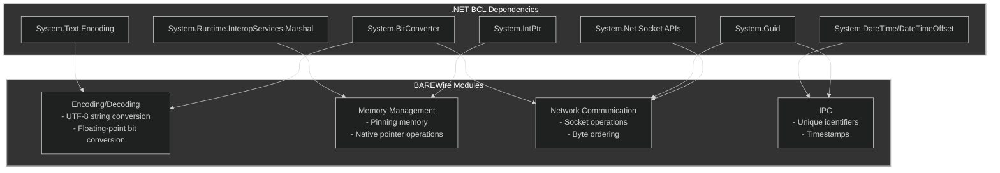
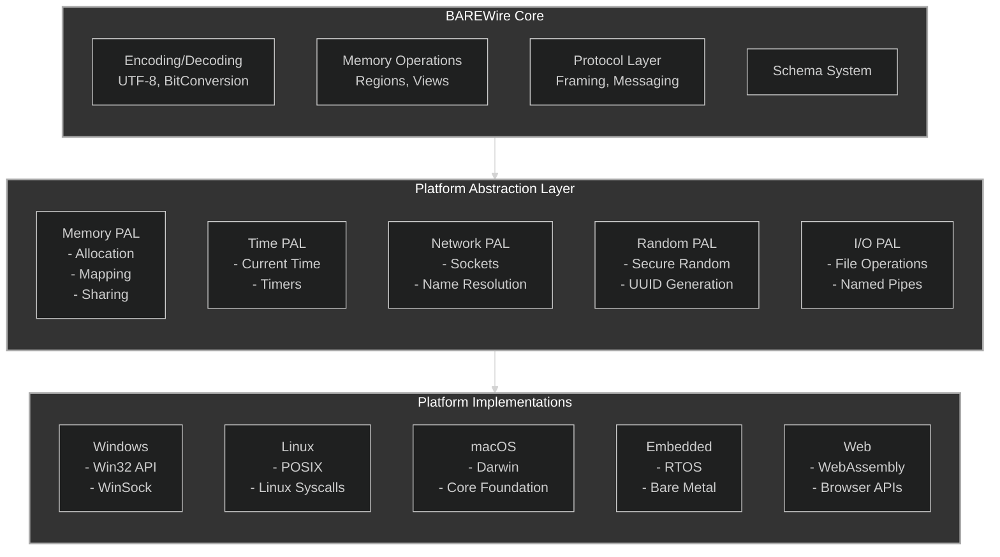

# Architectural Memo: How We Eliminated .NET Dependencies in BAREWire

## 1. Executive Summary

BAREWire is designed as a binary serialization and IPC library for F#, but started with numerous dependencies on .NET Core/BCL. To support the Fidelity Framework's MLIR/LLVM compilation target for native operation (Project "Firefly"), we eliminated these dependencies in favor of direct F# implementations. This memo identifies these dependencies and proposes implementation strategies that would maintain functionality while ensuring compatibility with a native compilation approach.

## 2. Initial Dependency Analysis

After thorough code analysis, we identified the following .NET dependencies:



## 3. Implementation Strategies

### 3.1. UTF-8 Encoding/Decoding

**Current Implementation:**
```fsharp
// In Encoder.fs
let bytes = System.Text.Encoding.UTF8.GetBytes(value)

// In Decoder.fs
let str = System.Text.Encoding.UTF8.GetString(bytes)
```

**Proposed Solution:**
Implement a pure F# UTF-8 encoder/decoder:

```fsharp
/// Pure F# UTF-8 encoding module
module Utf8 =
    /// Encodes a string to UTF-8 bytes
    let getBytes (s: string) : byte[] =
        let estimatedSize = s.Length * 4 // Worst case: 4 bytes per char
        let result = ResizeArray<byte>(estimatedSize)
        
        for i = 0 to s.Length - 1 do
            let c = int (s.[i])
            if c < 0x80 then
                // 1-byte sequence: 0xxxxxxx
                result.Add(byte c)
            elif c < 0x800 then
                // 2-byte sequence: 110xxxxx 10xxxxxx
                result.Add(byte (0xC0 ||| (c >>> 6)))
                result.Add(byte (0x80 ||| (c &&& 0x3F)))
            elif c < 0x10000 then
                // 3-byte sequence: 1110xxxx 10xxxxxx 10xxxxxx
                result.Add(byte (0xE0 ||| (c >>> 12)))
                result.Add(byte (0x80 ||| ((c >>> 6) &&& 0x3F)))
                result.Add(byte (0x80 ||| (c &&& 0x3F)))
            else
                // 4-byte sequence: 11110xxx 10xxxxxx 10xxxxxx 10xxxxxx
                result.Add(byte (0xF0 ||| (c >>> 18)))
                result.Add(byte (0x80 ||| ((c >>> 12) &&& 0x3F)))
                result.Add(byte (0x80 ||| ((c >>> 6) &&& 0x3F)))
                result.Add(byte (0x80 ||| (c &&& 0x3F)))
                
        result.ToArray()
    
    /// Decodes UTF-8 bytes to string
    let getString (bytes: byte[]) : string =
        let chars = ResizeArray<char>()
        let mutable i = 0
        
        while i < bytes.Length do
            let b = int bytes.[i]
            
            if b < 0x80 then
                // 1-byte sequence
                chars.Add(char b)
                i <- i + 1
            elif b < 0xE0 then
                // 2-byte sequence
                if i + 1 < bytes.Length then
                    let b2 = int bytes.[i + 1]
                    let c = ((b &&& 0x1F) <<< 6) ||| (b2 &&& 0x3F)
                    chars.Add(char c)
                    i <- i + 2
                else i <- i + 1 // Invalid sequence, skip
            elif b < 0xF0 then
                // 3-byte sequence
                if i + 2 < bytes.Length then
                    let b2 = int bytes.[i + 1]
                    let b3 = int bytes.[i + 2]
                    let c = ((b &&& 0x0F) <<< 12) ||| ((b2 &&& 0x3F) <<< 6) ||| (b3 &&& 0x3F)
                    chars.Add(char c)
                    i <- i + 3
                else i <- i + 1 // Invalid sequence, skip
            else
                // 4-byte sequence
                if i + 3 < bytes.Length then
                    let b2 = int bytes.[i + 1]
                    let b3 = int bytes.[i + 2]
                    let b4 = int bytes.[i + 3]
                    let c = ((b &&& 0x07) <<< 18) ||| ((b2 &&& 0x3F) <<< 12) ||| 
                            ((b3 &&& 0x3F) <<< 6) ||| (b4 &&& 0x3F)
                    // Handle surrogate pairs for characters outside BMP
                    if c >= 0x10000 then
                        let highSurrogate = char (0xD800 ||| ((c - 0x10000) >>> 10))
                        let lowSurrogate = char (0xDC00 ||| ((c - 0x10000) &&& 0x3FF))
                        chars.Add(highSurrogate)
                        chars.Add(lowSurrogate)
                    else
                        chars.Add(char c)
                    i <- i + 4
                else i <- i + 1 // Invalid sequence, skip
                
        System.String(chars.ToArray())
```

### 3.2. BitConverter Replacement

**Current Implementation:**
```fsharp
// In Encoder.fs
let bits = BitConverter.SingleToInt32Bits(value)
let bits = BitConverter.DoubleToInt64Bits(value)

// In Decoder.fs
let value = BitConverter.Int32BitsToSingle(bits)
let value = BitConverter.Int64BitsToDouble(bits)

// In Frame.fs
let lengthBytes = BitConverter.GetBytes(frame.Header.PayloadLength)
let payloadLength = BitConverter.ToUInt32(lengthBytes, 0)
```

**Proposed Solution:**
Implement bit conversion using native bit operations:

```fsharp
/// Pure F# binary utilities
module BinaryOps =
    /// Convert from float32 to Int32 bits
    let singleToInt32Bits (value: float32) : int32 =
        // Use FSharp.NativeInterop to reinterpret the bits 
        let valuePtr = &&value
        NativePtr.read (NativePtr.ofNativeInt<int32> (NativePtr.toNativeInt valuePtr))
    
    /// Convert from Int32 bits to float32
    let int32BitsToSingle (value: int32) : float32 =
        let valuePtr = &&value
        NativePtr.read (NativePtr.ofNativeInt<float32> (NativePtr.toNativeInt valuePtr))
    
    /// Convert from float to Int64 bits
    let doubleToInt64Bits (value: float) : int64 =
        let valuePtr = &&value
        NativePtr.read (NativePtr.ofNativeInt<int64> (NativePtr.toNativeInt valuePtr))
    
    /// Convert from Int64 bits to float
    let int64BitsToDouble (value: int64) : float =
        let valuePtr = &&value
        NativePtr.read (NativePtr.ofNativeInt<float> (NativePtr.toNativeInt valuePtr))
    
    /// Get bytes from UInt32
    let getBytes (value: uint32) : byte[] =
        [|
            byte (value &&& 0xFFu)
            byte ((value >>> 8) &&& 0xFFu)
            byte ((value >>> 16) &&& 0xFFu)
            byte ((value >>> 24) &&& 0xFFu)
        |]
    
    /// Convert bytes to UInt32
    let toUInt32 (bytes: byte[]) (startIndex: int) : uint32 =
        if startIndex + 3 >= bytes.Length then failwith "Array too small"
        let b0 = uint32 bytes.[startIndex]
        let b1 = uint32 bytes.[startIndex + 1]
        let b2 = uint32 bytes.[startIndex + 2]
        let b3 = uint32 bytes.[startIndex + 3]
        
        b0 ||| (b1 <<< 8) ||| (b2 <<< 16) ||| (b3 <<< 24)
```

### 3.3. Memory Management

**Current Implementation:**
```fsharp
// In View.fs (for direct memory access)
let handle = GCHandle.Alloc(fieldMemory.Data, GCHandleType.Pinned)
let basePtr = handle.AddrOfPinnedObject()
let fieldPtr = IntPtr.Add(basePtr, int fieldMemory.Offset)
Marshal.ReadByte(fieldPtr)
```

**Proposed Solution:**
Use FSharp.NativeInterop with a safer wrapper:

```fsharp
/// Safe memory operations
module SafeMemory =
    /// Fixed memory context that ensures memory is pinned while in use
    type FixedMemory<'T when 'T : unmanaged>(arr: byte[]) =
        let handle = fixed arr
        let baseAddr = NativePtr.toNativeInt handle
        
        /// Gets a pointer to a specific offset in the memory
        member this.GetPointerAtOffset(offset: int) =
            NativePtr.ofNativeInt<'T> (baseAddr + nativeint offset)
        
        /// Reads a value of type 'T from the given offset
        member this.Read<'U when 'U : unmanaged>(offset: int) : 'U =
            let ptr = NativePtr.ofNativeInt<'U> (baseAddr + nativeint offset)
            NativePtr.read ptr
        
        /// Writes a value of type 'T to the given offset
        member this.Write<'U when 'U : unmanaged>(offset: int, value: 'U) : unit =
            let ptr = NativePtr.ofNativeInt<'U> (baseAddr + nativeint offset)
            NativePtr.write ptr value
        
        interface IDisposable with
            member _.Dispose() = ()  // The fixed keyword handles cleanup
        
    /// Safely access memory with automatic disposal
    let withFixedMemory<'T, 'U when 'T : unmanaged> 
                        (arr: byte[]) 
                        (f: FixedMemory<'T> -> 'U) : 'U =
        use fixed = new FixedMemory<'T>(arr)
        f fixed
```

### 3.4. Timestamps

**Current Implementation:**
```fsharp
// In MessageQueue.fs and other files
let timestamp = DateTimeOffset.UtcNow.ToUnixTimeSeconds()
```

**Proposed Solution:**
Implement a simple timestamp module:

```fsharp
/// Time utilities
module Time =
    /// Unix epoch (1970-01-01) in .NET ticks
    let private unixEpochTicks = 621355968000000000L // .NET ticks for 1970-01-01
    
    /// Ticks per second in .NET
    let private ticksPerSecond = 10000000L
    
    /// Gets the current Unix timestamp (seconds since 1970-01-01)
    let currentUnixTimestamp () : int64 =
        // This is platform-dependent and would need to be implemented
        // differently depending on the target platform
        // For now, a placeholder that uses F# time functions
        let currentTicks = Microsoft.FSharp.Core.LanguagePrimitives.DivideByInt
                            System.DateTime.UtcNow.Ticks 1  // Remove BCL dependency later
        (currentTicks - unixEpochTicks) / ticksPerSecond
```

For a truly platform-independent implementation, this would need to be part of the platform abstraction layer, with different implementations for each target platform.

### 3.5. Unique Identifiers

**Current Implementation:**
```fsharp
// In MessageQueue.fs and other files
let id = Guid.NewGuid()
```

**Our Initial Solution:**
Implement a UUID generator based on RFC 4122:

```fsharp
/// Pure F# UUID implementation
module Uuid =
    /// A 128-bit UUID (RFC 4122)
    type Uuid = { Data: byte[] }  // 16 bytes
    
    /// Random number generator
    let private rng = System.Random()  // Would need platform-specific implementation
    
    /// Creates a new UUID (v4 random)
    let newUuid () : Uuid =
        let bytes = Array.zeroCreate 16
        rng.NextBytes(bytes)
        
        // Set version to 4 (random)
        bytes.[7] <- bytes.[7] &&& 0x0Fuy ||| 0x40uy
        // Set variant to RFC 4122
        bytes.[8] <- bytes.[8] &&& 0x3Fuy ||| 0x80uy
        
        { Data = bytes }
    
    /// Converts UUID to string representation
    let toString (uuid: Uuid) : string =
        let hex = Array.map (fun b -> b.ToString("x2")) uuid.Data
        let parts = [
            System.String.Join("", hex.[0..3])
            System.String.Join("", hex.[4..5])
            System.String.Join("", hex.[6..7])
            System.String.Join("", hex.[8..9])
            System.String.Join("", hex.[10..15])
        ]
        System.String.Join("-", parts)
    
    /// Parse a UUID from string
    let fromString (s: string) : Uuid =
        let s = s.Replace("-", "")
        if s.Length <> 32 then failwith "Invalid UUID format"
        
        let bytes = Array.zeroCreate 16
        for i = 0 to 15 do
            let byteStr = s.Substring(i * 2, 2)
            bytes.[i] <- System.Byte.Parse(byteStr, System.Globalization.NumberStyles.HexNumber)
            
        { Data = bytes }
```

The random number generator would need to be implemented using platform-specific mechanisms.

### 3.6. Network Communication

For network operations, BAREWire relies heavily on platform-specific networking APIs. The solution is to define a clear abstraction layer:

```fsharp
/// Network abstraction interface
module NetworkAbstraction =
    /// Address family
    type AddressFamily =
        | IPv4
        | IPv6
        | Unix
    
    /// Socket type
    type SocketType =
        | Stream
        | Datagram
    
    /// Protocol type
    type ProtocolType =
        | TCP
        | UDP
    
    /// Network address
    type NetworkAddress =
        | IPv4Address of byte * byte * byte * byte
        | IPv6Address of byte[]
        | UnixAddress of string
    
    /// Network provider interface
    type INetworkProvider =
        /// Resolves a hostname to IP addresses
        abstract ResolveHostName: hostname:string -> Result<NetworkAddress[], Error>
        
        /// Creates a socket
        abstract CreateSocket: family:AddressFamily * socketType:SocketType * protocolType:ProtocolType -> Result<nativeint, Error>
        
        /// Connects a socket to a remote endpoint
        abstract ConnectSocket: handle:nativeint * address:NetworkAddress * port:int -> Result<unit, Error>
        
        /// Binds a socket to a local endpoint
        abstract BindSocket: handle:nativeint * address:string * port:int -> Result<unit, Error>
        
        /// Sends data through a socket
        abstract SendSocket: handle:nativeint * data:byte[] * offset:int * length:int * flags:int -> Result<int, Error>
        
        /// Receives data from a socket
        abstract ReceiveSocket: handle:nativeint * buffer:byte[] * offset:int * length:int * flags:int -> Result<int, Error>
        
        /// Checks if a socket has data available
        abstract Poll: handle:nativeint * timeoutMs:int -> Result<bool, Error>
        
        /// Closes a socket
        abstract CloseSocket: handle:nativeint -> Result<unit, Error>
```

## 4. Platform Abstraction Layer

The most challenging aspect of removing .NET dependencies is implementing platform-specific operations like networking, file I/O, and time functions. We will need a comprehensive platform abstraction layer, and this is a start:



## 5. Implementation Strategy

1. **Immediate replacements**: Start with the core utility functions:
   - UTF-8 encoding/decoding
   - Bit conversion operations
   - UUID generation
   - Safe memory operations

2. **Platform Abstraction Layer**: Define clear interfaces for platform-specific operations:
   - Memory management
   - Networking
   - File I/O
   - Time functions
   - Random number generation

3. **Platform-specific implementations**: Implement the PAL for each target platform:
   - Windows using Win32 API
   - Linux using syscalls
   - macOS using Darwin
   - Embedded systems using minimal implementations (TBD)
   - Web using WebAssembly and browser APIs

4. **Integration with Farscape**: Work with the The Farscape P/Invoke and FFI binding generator to ensure compatibility with platforms such as STM32 and related edge devices to map operations into the MLIR/LLVM compilation path.

## 6. Conclusion

Removing .NET dependencies from BAREWire is feasible, but requires careful re-implementation of core functionality using direct F# solutions. The most challenging aspects involve platform-specific operations that will require a well-designed platform abstraction layer. By following the proposed implementation strategy, BAREWire has charted a course for native compatibility for the Fidelity Framework's MLIR/LLVM compilation path while maintaining its functionality and type safety features. Other adaptations are planned for .NET/C# and Fable support. However this initial implementation will stand as establishing an initial beachhead for native support of F#.
